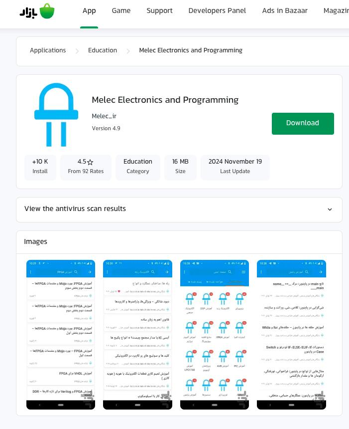
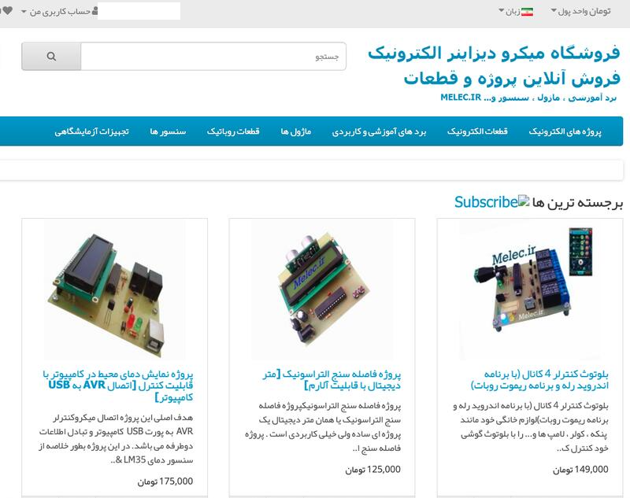
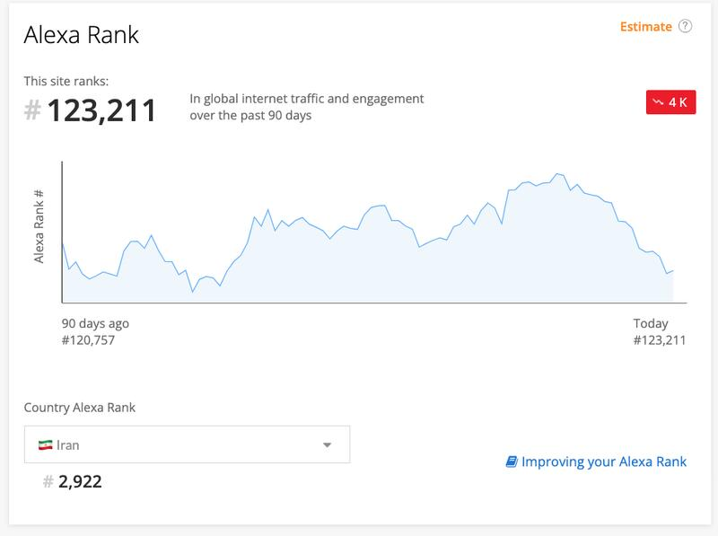
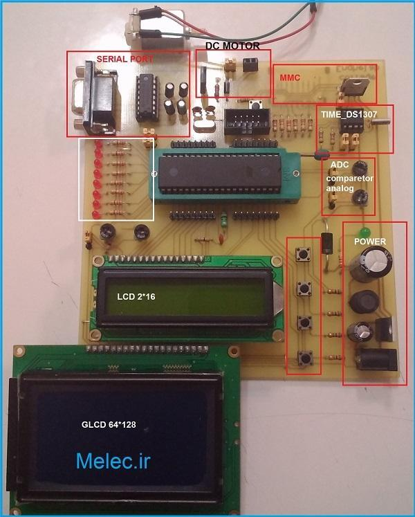
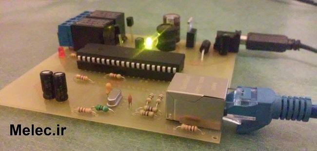
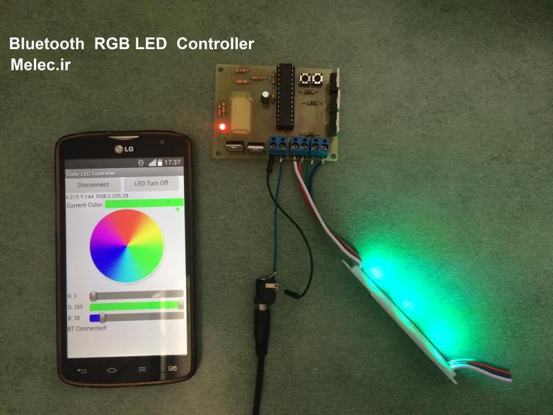
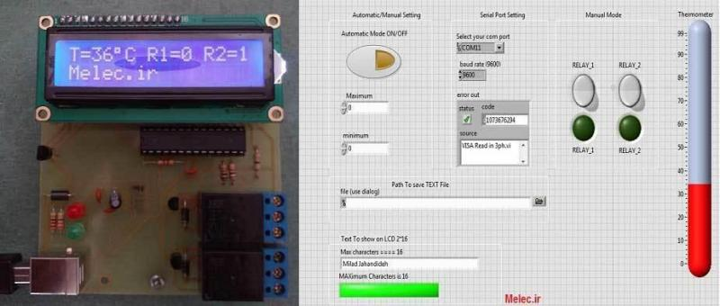
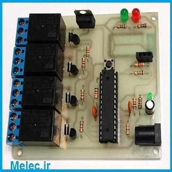

THIS FILE IS DRAFT...

## Milad Jahandideh
Site Reliability Engineer | Tech Lead

[Email](mailto:milad.jahandideh.u@gmail.com)

[Website](https://milad-jahandideh.com/)

## About Me

I'm a Site Reliability Engineer (SRE) and Tech Lead with over 5 years of experience in building, scaling, and maintaining high-availability cloud infrastructures. My expertise spans across Kubernetes, OpenStack, Ceph, and DevOps automation, with a deep focus on reliability, performance, and operational excellence.

At ArvanCloud, I lead SRE and systems engineering initiatives, driving improvements in system scalability, monitoring, and resilience across large distributed systems.

## Experience

### ArvanCloud.ir — Site Reliability Engineer / Tech Lead

Nov 2020 - Present | Remote

In ArvanCloud we are providing Infrastructure as a Service (IaaS) solutions with OpenStack, Ceph, and Kubernetes.

-   Participate in project planning, task estimation, and prioritization to maintain alignment with organizational goals
-   Collaborate with cross-functional teams to design and implement scalable, resilient infrastructure solutions
-   Improve system reliability by building robust monitoring and alerting stacks using Prometheus, Grafana, and custom alerting rules
-   Promote SRE best practices, driving a culture of reliability, automation, and continuous improvement
-   Design and maintain CI/CD pipelines using GitLab CI, improving deployment speed and consistency
-   Contribute to Infrastructure-as-Code initiatives using Ansible, enabling repeatable and automated deployments
-   Implement Load Balancer as a Service (LBaaS) using the OpenStack Octavia project
-   Deploy, operate, and optimize multiple Kubernetes clusters
-   Manage dozens of microservices on Kubernetes using Helm charts, ensuring efficient rollouts and lifecycle management
-   Led a VPC project connecting three OpenStack clusters using VXLAN overlays and BGP EVPN routing, leveraging OVN and Open vSwitch to deliver unified networking and secure inter-cluster communication.
### Mahsan.co — Linux System Administrator

Dec 2018 - Nov 2020 | On-site

-   Implemented VMware ESXi virtualization infrastructure to facilitate code development and testing for developers
-   Managed deployment and maintenance of applications on a large-scale Linux server environment
-   Automated repetitive tasks using Ansible and Shell Scripting
-   Containerized monolithic applications and optimized them to run on LXC
-   Implemented ELK Stack to collect and analyze logs from thousands of servers centrally
-   Utilized Zabbix for server monitoring
-   Implemented UI testing automation using Selenium
-   Provided Linux-related technical support and assistance to developers

### Melec.ir — Webmaster & Founder

Nov 2013 - Dec 2018 | Remote

-   Founded Melec.ir in Nov 2013 to share content about Electronic Engineering and Microcontroller programming as a side project during university studies
-   Personally authored over 500 blog posts focused on Electronics, Microcontrollers, and Programming
-   Built a strong online presence in the Persian embedded systems community, resulting in:
    -   1,075 published posts
    -   5,556 comments
    -   432 Q&A entries
    -   Estimated 11 million visits

#### Android Application with 10k+ install

- [Cafe Bazaar Link](https://cafebazaar.ir/app/com.melec?l=en)

#### Shop.Melec.ir was Designed OpenCart

- [Shop Archive](https://web.archive.org/web/20151007060813/http://shop.melec.ir/)

#### 10th birthday of serving free educational content since 2013

- [10th Birthday Post](https://melec.ir/melec-ir-10th-birthday/)

#### Alexa Rank of 2922 in Iran

- [Alexa Ranking](https://web.archive.org/web/20220201085754/https://www.alexa.com/siteinfo/melec.ir)

-   Worked as an Embedded System Developer on:
    -   Ethernet Relay Controller with TCP/IP and HTTP protocol
    -   Ethernet Monitoring with TCP/IP and HTTP protocol
    -   Temperature Monitoring using LabVIEW
    -   RGB LED Controller with an Android app for mass production
    -   Numerous custom embedded systems for commercial clients

#### AVR evaluation board

- [Project Link](https://bit.ly/avr-evaluation-board)

#### Ethernet Relay Controller With TCP/IP and HTTP protocol

- [Project Link](https://bit.ly/network-enc28j60)

#### Bluetooth RGB Controller

- [Project Link](http://bit.ly/3Cu0XNk)

#### Temperature monitoring and control in LabVIEW software

- [Project Link](https://bit.ly/labview-monitoring)

#### Bluetooth Controller

- [Project Link](https://bit.ly/home-bluetooth)

### Adeeco — Embedded Systems Developer

Dec 2017 - Nov 2018 | On-site

-   Worked on embedded systems for industrial applications.

[Adeeco.org Archive page](https://web.archive.org/web/20181031044502/http://adeeco.org/)

## Education

### MS – Technology and Innovation Management

**Iran University of Science and Technology** (2020-2022)

**Grade:** 16.31/20

Technology and Innovation Management @ School of Management, Economics and Progress Engineering

**Presentations:**

- [Mergers & Acquisitions [FA]](https://www.slideshare.net/MiladJahandideh/mergers-acquisitions-fa)
- [Trend Impact Analysis [FA]](https://www.slideshare.net/MiladJahandideh/trend-impact-analysis-248539796)
- [Open Innovation [FA]](https://www.slideshare.net/MiladJahandideh/6th-generation-innovation)
- [Product platform [FA]](https://www.slideshare.net/MiladJahandideh/product-platform)
- [Thinking, Fast and Slow [FA]](https://www.aparat.com/v/v8639s8)

**Verification Code (Sehat):** `14012380569379825568`

### BS – Information and Communications Technology

**Shamsipour Technical and Vocational College** (2013-2015)

**Grade:** 16.76/20

ICT Engineering @ Shamsipour Technical and Vocational College

**Final Thesis:**

- [Temperature monitoring and control in LabVIEW software [FA]](https://www.slideshare.net/MiladJahandideh/labviewlm35tcontrolmelecpdf)

**Presentations:**

- [CDN Content Delivery Networks [FA]](https://www.slideshare.net/MiladJahandideh/cdn-content-delivery-networks)
- [OTDR Optical Time Domain Reflectometer [FA]](https://www.slideshare.net/MiladJahandideh/otdr-optical-time-domain-reflectometer-fa)
- [SNMP IPHost Network Monitoring [FA]](https://www.slideshare.net/MiladJahandideh/snmp-iphost-network-monitoring)
- [GSM/GPRS MODULES [FA]](https://www.slideshare.net/MiladJahandideh/gsmgprs-modules)

**Verification Code (Sehat):** `14042088748918245106`

### AS – Electronic Engineering

**Technical and Vocational University** (2011-2013)

**Grade:** 18.06/20

Electronic Engineering @ Enghelāb-e Eslāmi Technical College

**Resources:**

- [Orcad Pspice 9.2 Tutorial [FA]](https://www.slideshare.net/MiladJahandideh/orcad-pspice-92-tutorial-fa)
- [SD Memory Card Library for AVR Microcontrollers](https://github.com/miladjahandideh/sd-memory-card-library-for-avr-microcontrollers)

**Verification Code (Sehat):** `14042370219301862698`

### Diploma – Electronics

**Vocational School** (2009-2011)

## Tech Stack

Amazon AWS, OpenStack, Terraform, VMware ESXi, KVM, QEMU, Ceph, Python, Golang, Docker, Kubernetes, Helm, GitLab, ArgoCD, Ansible, MariaDB, Grafana, Prometheus, OpenSearch, RabbitMQ, Jaeger, Linux, Redis