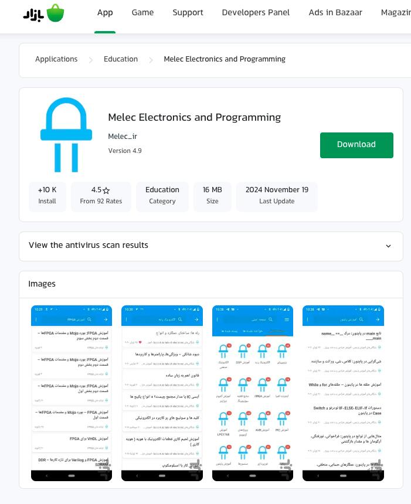
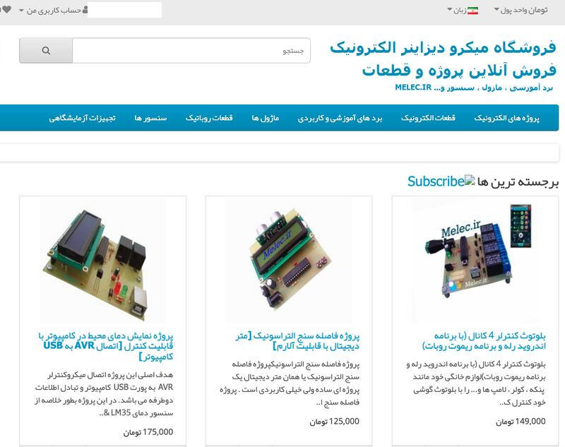
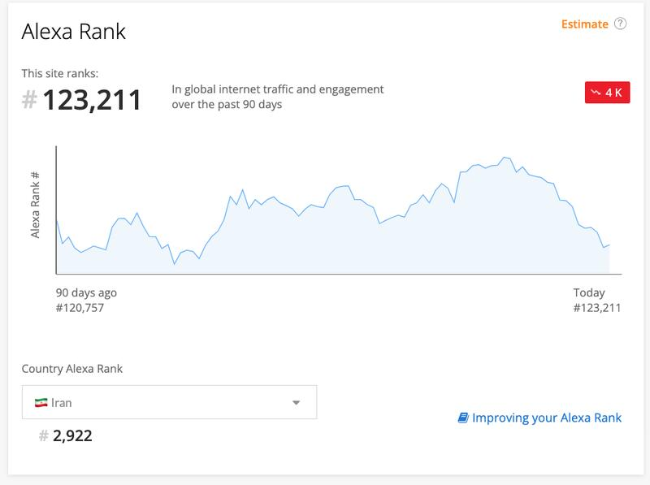
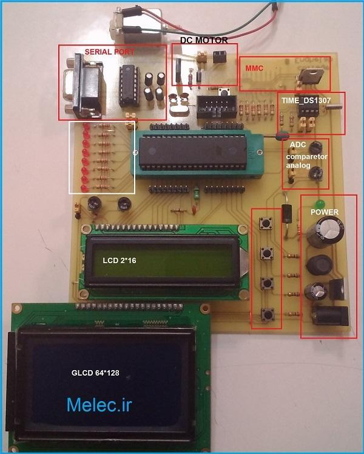
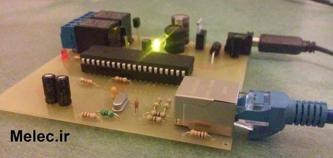
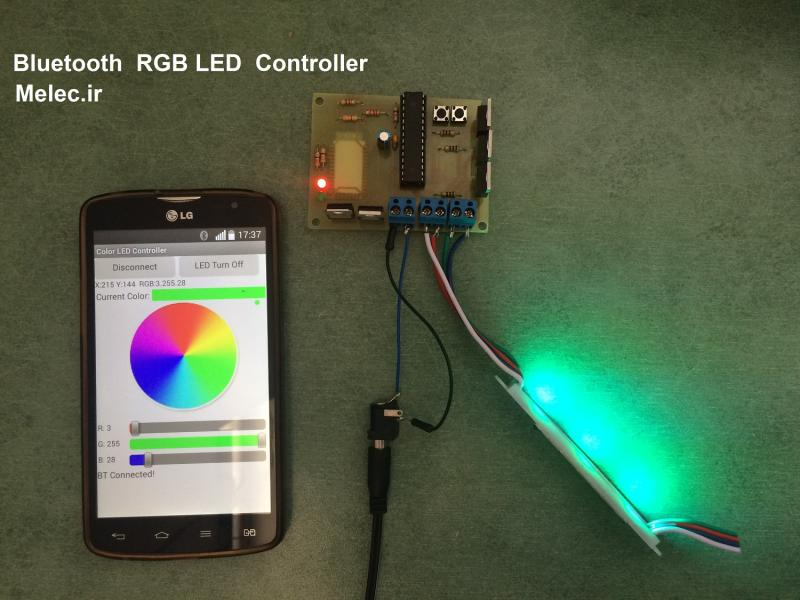
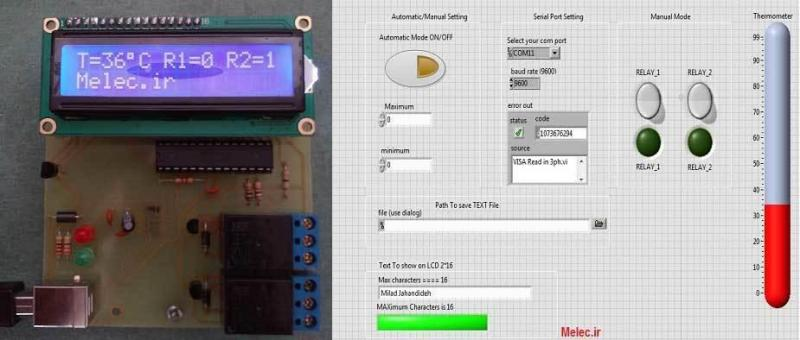
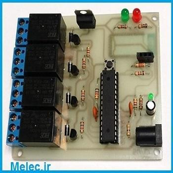

THIS FILE IS DRAFT...

## Milad Jahandideh
Site Reliability Engineer | Tech Lead

[Email](mailto:milad.jahandideh.u@gmail.com)

[Website](https://milad-jahandideh.com/)

## About Me

Tech Lead and Site Reliability Engineer with 7+ years of experience designing, operating, and scaling high-availability cloud infrastructure across OpenStack, Ceph, Kubernetes, and Linux-based platforms.

My work focuses on building reliable infrastructure foundations, improving observability, automating operations, and helping engineering teams deliver production systems with clear standards, practical processes, and strong technical execution.

## Experience

### ArvanCloud.ir — Site Reliability Engineer / Tech Lead

Nov 2020 - Present | Remote

ArvanCloud is a leading Iranian cloud provider delivering Infrastructure as a Service (IaaS) at scale, built on OpenStack, Ceph, and Kubernetes.

-   Lead the SRE chapter for ArvanCloud's IaaS platform, defining SLOs, owning incident response processes, and establishing reliability standards across core infrastructure services
-   Architected and delivered a VPC project connecting three OpenStack clusters via VXLAN overlays and BGP EVPN routing using OVN and Open vSwitch, enabling secure and unified inter-cluster networking at scale; published an open-source [OVN/OVS CLI cheatsheet](https://gist.github.com/miladjahandideh/fa2dab5aa64e41bb80625541119105e1) on GitHub
-   Designed and scaled the observability stack using Prometheus, Grafana, and custom alerting rules, significantly reducing MTTR and improving incident detection across distributed systems
-   Deployed and operated multiple production Kubernetes clusters, managing dozens of microservices via Helm charts and GitOps workflows with ArgoCD
-   Integrated Ceph RBD with OpenStack Cinder for persistent block storage and deployed Ceph CSI for Kubernetes persistent volume provisioning; published an open-source [Ceph CLI cheatsheet](https://github.com/miladjahandideh/ceph-cli-cheatsheet) on GitHub
-   Implemented Load Balancer as a Service (LBaaS) using OpenStack Octavia, extending self-service networking capabilities for cloud tenants
-   Built and maintained CI/CD pipelines with GitLab CI and standardized Infrastructure-as-Code practices with Ansible and Terraform, enabling consistent and automated deployments
-   Participate in on-call rotations, lead incident response, and author post-mortems to drive systemic reliability improvements
-   Maintain operational documentation including architecture diagrams, runbooks, and on-call playbooks to support team scaling and knowledge transfer

### Mahsan.co — Linux System Administrator

Dec 2018 - Nov 2020 | On-site

-   Administered and maintained a large-scale Linux server environment, supporting deployments across hundreds of servers for a defense-sector organization
-   Deployed VMware ESXi virtualization infrastructure, enabling isolated development and testing environments for engineering teams
-   Eliminated manual toil by automating infrastructure operations with Ansible and Shell Scripting
-   Containerized and migrated monolithic applications to LXC, improving resource efficiency and deployment repeatability
-   Built a centralized logging platform using the ELK Stack to aggregate and analyze logs from thousands of servers, enabling proactive issue detection
-   Configured Zabbix monitoring with alerting, enabling proactive capacity tracking and server health visibility

### Melec.ir — Webmaster & Founder

Nov 2013 - Dec 2018 | Remote

-   Founded Melec.ir in Nov 2013 to share content about Electronic Engineering and Microcontroller programming as a side project during university studies
-   Authored 500+ blog posts myself, focused on Electronics, Microcontrollers, and Programming
-   Built a strong online presence in the Persian embedded systems community, resulting in:
    -   1,075 published posts
    -   5,556 comments
    -   432 Q&A entries
    -   Estimated ~2k daily users

#### Android Application with 17k+ install

- [Cafe Bazaar Link](https://cafebazaar.ir/app/com.melec?l=en)

#### Shop.Melec.ir was Designed OpenCart

- [Shop Archive](https://web.archive.org/web/20151007060813/http://shop.melec.ir/)

#### 10th birthday of serving free educational content since 2013

- [10th Birthday Post](https://melec.ir/melec-ir-10th-birthday/)

#### Alexa Rank of 2922 in Iran

- [Alexa Ranking](https://web.archive.org/web/20220201085754/https://www.alexa.com/siteinfo/melec.ir)

-   Worked as an Embedded System Developer on:
    -   Ethernet Relay Controller with TCP/IP and HTTP protocol
    -   Ethernet Monitoring with TCP/IP and HTTP protocol
    -   Temperature Monitoring using LabVIEW
    -   RGB LED Controller with an Android app for mass production
    -   Numerous custom embedded systems for commercial clients

#### AVR evaluation board

- [Project Link](https://bit.ly/avr-evaluation-board)

#### Ethernet Relay Controller With TCP/IP and HTTP protocol

- [Project Link](https://bit.ly/network-enc28j60)

#### Bluetooth RGB Controller

- [Project Link](http://bit.ly/3Cu0XNk)

#### Temperature monitoring and control in LabVIEW software

- [Project Link](https://bit.ly/labview-monitoring)

#### Bluetooth Controller

- [Project Link](https://bit.ly/home-bluetooth)

### Adeeco — Embedded Systems Developer

Dec 2017 - Nov 2018 | On-site

-   Developed firmware for industrial embedded systems using AVR and ARM microcontrollers
-   Designed and built hardware-software integrated solutions for automation and control applications

[Adeeco.org Archive page](https://web.archive.org/web/20181031044502/http://adeeco.org/)

## Education

### MS – Technology and Innovation Management

**Iran University of Science and Technology** (2020-2022)

**Grade:** 16.31/20

Technology and Innovation Management at the School of Management, Economics, and Progress Engineering

**Presentations:**

- [Mergers & Acquisitions [FA]](https://www.slideshare.net/MiladJahandideh/mergers-acquisitions-fa)
- [Trend Impact Analysis [FA]](https://www.slideshare.net/MiladJahandideh/trend-impact-analysis-248539796)
- [Open Innovation [FA]](https://www.slideshare.net/MiladJahandideh/6th-generation-innovation)
- [Product platform [FA]](https://www.slideshare.net/MiladJahandideh/product-platform)
- [Thinking, Fast and Slow [FA]](https://www.aparat.com/v/v8639s8)

**Verification Code:** `14012380569379825568`

### BS – Information and Communications Technology

**Shamsipour Technical and Vocational College** (2013-2015)

**Grade:** 16.76/20

ICT Engineering @ Shamsipour Technical and Vocational College

**Final Thesis:**

- [Temperature monitoring and control in LabVIEW software [FA]](https://www.slideshare.net/MiladJahandideh/labviewlm35tcontrolmelecpdf)

**Presentations:**

- [CDN Content Delivery Networks [FA]](https://www.slideshare.net/MiladJahandideh/cdn-content-delivery-networks)
- [OTDR Optical Time Domain Reflectometer [FA]](https://www.slideshare.net/MiladJahandideh/otdr-optical-time-domain-reflectometer-fa)
- [SNMP IPHost Network Monitoring [FA]](https://www.slideshare.net/MiladJahandideh/snmp-iphost-network-monitoring)
- [GSM/GPRS MODULES [FA]](https://www.slideshare.net/MiladJahandideh/gsmgprs-modules)

**Verification Code:** `14042088748918245106`

### AS – Electronic Engineering

**Technical and Vocational University** (2011-2013)

**Grade:** 18.06/20

Electronic Engineering @ Enghelāb-e Eslāmi Technical College

**Resources:**

- [Orcad Pspice 9.2 Tutorial [FA]](https://www.slideshare.net/MiladJahandideh/orcad-pspice-92-tutorial-fa)
- [SD Memory Card Library for AVR Microcontrollers](https://github.com/miladjahandideh/sd-memory-card-library-for-avr-microcontrollers)

**Verification Code:** `14042370219301862698`

### Diploma – Electronics

**Vocational School** (2009-2011)

## Tech Stack

_Order matches `cv.json` `tech_stack`._

Linux, Kubernetes, OpenStack, Ceph, Docker, Helm, ArgoCD, Prometheus, Grafana, Jaeger, OpenSearch, Ansible, Terraform, GitLab CI, GitHub Actions, Git, Golang, Python, Bash, OVN, Open vSwitch, TCP/IP, CCNA, Amazon AWS, Amazon EC2, Amazon S3, RabbitMQ, Redis, MariaDB, Zabbix, VMware ESXi, KVM, QEMU
